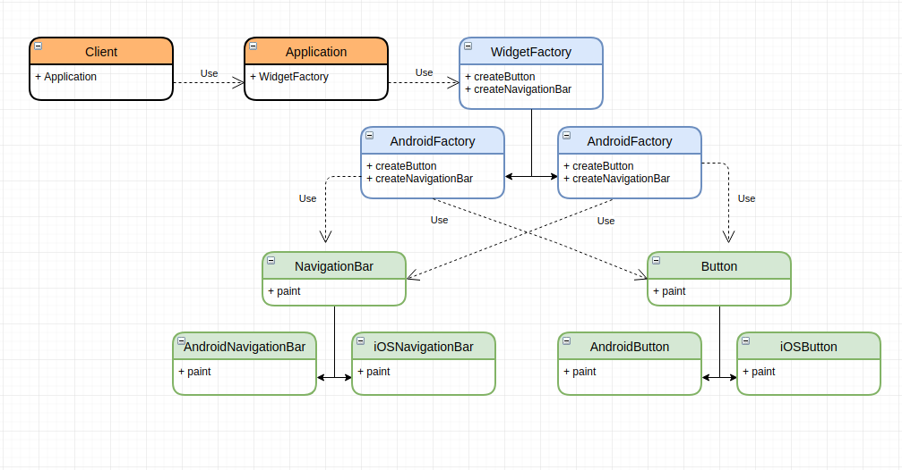

# Abstract Factory
`The abstract factory is used when we need to create families of products without specifying their concrete classes`

Pros
- the pattern avoids tight coupling between the client and object creation.
- allows bundling related product objects and promises compatibility between them.

Cons
- if the abstract factory interface changes (i.e. ComputerFactory in the example above),
then all factories would need to be updated.
-  The code may become more complicated than it should be due to the new classes

Example:   
We have installed an application on our smartphone which is written in some "magic" cross-platform language.
At startup our application set up a configuration and depends on OS platform, it pulls the corresponding Android or iOS widgets.  


Widget classes

Button
```java
public interface Button {
    void paint();
}
```

AndroidButton
```java
public class AndroidButton implements Button {
    @Override
    public void paint() {
        System.out.println("Drawing Android Button");
    }
}
```

IOSButton
```java
public class IOSButton implements Button {
    @Override
    public void paint() {
        System.out.println("Drawing iOS Button");
    }
}
```

NavigationBar
```java
public interface NavigationBar {
    void paint();
}
```

AndroidNavigationBar
```java
public class AndroidNavigationBar implements NavigationBar {
    @Override
    public void paint() {
        System.out.println("Drawing Android Navigation Bar");
    }
}
```

IOSNavigationBar
```java
public class IOSNavigationBar implements NavigationBar {
    @Override
    public void paint() {
        System.out.println("Drawing iOS Navigation Bar");
    }
}
```

Also we have `WidgetFactory` interface and  its implementations. 
Note that each concrete factory class knows which widget implementations it needs.

WidgetFactory
```java
public interface WidgetFactory {
    Button createButton();
    NavigationBar createNavigationBar();
}
```

AndroidWidgetFactory
```java
public class AndroidWidgetFactory implements WidgetFactory {
    @Override
    public Button createButton() {
        return new AndroidButton();
    }

    @Override
    public NavigationBar createNavigationBar() {
        return new AndroidNavigationBar();
    }
}
```

IOSWidgetFactory
```java
public class IOSWidgetFactory implements WidgetFactory {
    @Override
    public Button createButton() {
        return new IOSButton();
    }

    @Override
    public NavigationBar createNavigationBar() {
        return new IOSNavigationBar();
    }
}
```

`Application` class represents installed application on a user smartphone.
```java
public class Application {
    private Button button;
    private NavigationBar navigationBar;

    public Application() {
        configureApplication();
    }

    private void configureApplication() {
        String platform = readPlatformType();

        WidgetFactory factory = switch (platform) {
            case "android" -> new AndroidWidgetFactory();
            case "ios" -> new IOSWidgetFactory();
            default -> throw new RuntimeException("Unsupported platform");
        };

        button = factory.createButton();
        navigationBar = factory.createNavigationBar();
    }

    public void paint() {
        button.paint();
        navigationBar.paint();
    }
}
```

Client is our smartphone that runs the application
```java
public class Client {
    public static void main(String[] args) {
        Application application = new Application();
        application.paint();
    }
}
```