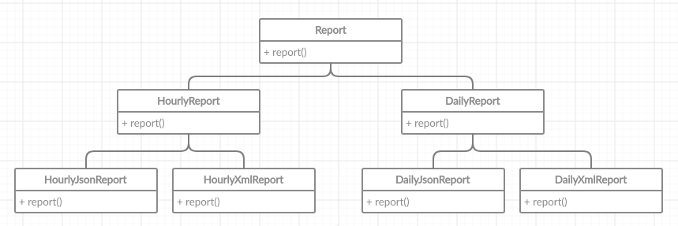
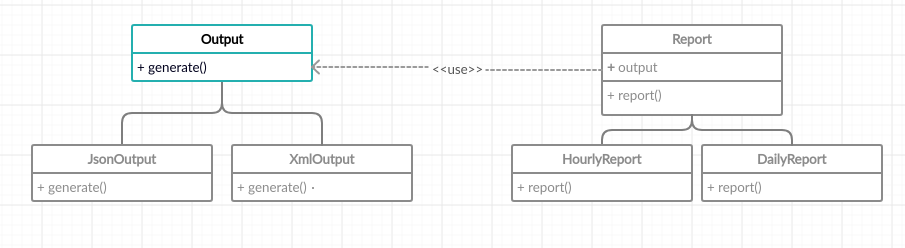

# Bridge
`Bridge pattern decouples an abstraction and its implementations 
 by providing a bridge between them that they can vary independently`
 
 It's a very useful pattern when you have two (or more) axes of changes (class hierarchies)
 and you need different combinations of them. For example, you have `Report` class 
 and its implementations `HourlyReport` and `MonthlyReport`. 
 You want to extend this class hierarchy to incorporate formats, so you plan to create
 `Json` and `Xml` report subclasses. 
 
 So the hierarchy might look something like this:   
 
 
 So what's wrong with that example? 
 Number of class combinations grows in geometric progression.
 Just imagine that we need to add `Monthly`, `Yearly` report and add `Pdf` format.
 How many more classes we need to add?
 
 `Note that this example has two axes of changes: formats and reports.`
 
 So instead of this crazy implementation, we could use the `Bridge` pattern. 
 The `Bridge` pattern attempts to solve this problem 
 by switching from inheritance to the object composition. 
 So our hierarchy might look like this: 
 
 
 Here's Output interface and its implementations
 ```java
public interface Output {
    void generate();
}
```

JsonOutput
```java
public class JsonOutput implements Output {
    @Override
    public void generate() {
        System.out.println("generating json...");
    }
}
```

XmlOutput
```java
public class XmlOutput implements Output {
    @Override
    public void generate() {
        System.out.println("generating xml...");
    }
}
```

Report
```java
abstract public class Report {
    protected final Output output;

    public Report(Output output) {
        this.output = output;
    }

    abstract public void report();
}
```

HourlyReport
```java
public class HourlyReport extends Report {
    public HourlyReport(Output output) {
        super(output);
    }

    @Override
    public void report() {
        System.out.println("Creating hourly report ...");
        output.generate();
    }
}
```

DailyReport
```java
public class DailyReport extends Report {
    public DailyReport(Output output) {
        super(output);
    }

    @Override
    public void report() {
        System.out.println("Creating daily report ...");
        output.generate();
    }
}
```

And see how easily we can create different reports in any formats:
```java
public class Main {
    public static void main(String[] args) {
        Report dailyJsonReport = new DailyReport(new JsonOutput());
        dailyJsonReport.report();

        Report hourlyXmlReport = new HourlyReport(new XmlOutput());
        hourlyXmlReport.report();
    }
}
```