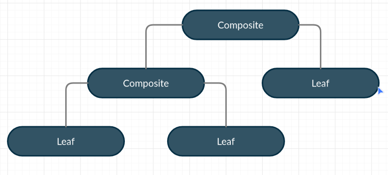
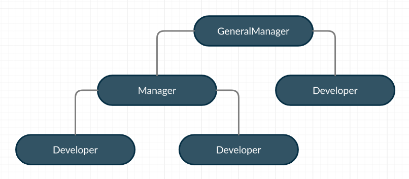

# Composite
`Let you compose objects into tree structures and then work with these structures 
as if they were individual objects`

Using the Composite pattern makes sense only when 
the core model of your app can be represented as a tree.

The pattern defines below concepts-

`Component` – It is either an interface or an abstract class with the general methods to manage the child composites. It is the base interface.  
`Leaf` – it represents leaf object in composite design, it has no children (no reference to the other objects.) and defines behavior for primitive objects in the composite pattern.  
`Composite` – it stores children’s i.e leaf elements. It implements base component methods and defines child-related operations.  
`Client` – it manipulates objects in the composition through the component interface.  


For understanding, we will take a simple example of company hierarchy. 
In this, we will have a `General Manager`, `Manager`, and `Developer`. 
If we refer above diagram, in our example we will try to create something like below:


Let's define components:
  
Employee interface 
```java
public interface Employee {
    void print();
}
```

Three implementations of `Employee` interface:  

Developer
```java
public class Developer implements Employee {
    private String name;

    public Developer(String name) {
        this.name = name;
    }

    @Override
    public void print() {
        System.out.println(name);
    }

}
```

Manager
```java
public class Manager implements Employee {
    private String name;
    private List<Employee> reportees = new ArrayList<>();

    public Manager(String name) {
        this.name = name;
    }

    public void addReportee(Employee e) {
        reportees.add(e);
    }

    public void remove(Employee e) {
        reportees.remove(e);
    }

    @Override
    public void print() {
        System.out.println(name);
        System.out.println("Reportees..");
        for(Employee e : reportees) {
            e.print();
        }
    }
}
```

GeneralManager
```java
public class GeneralManager implements Employee {
    private String name;
    private List<Employee> reportees = new ArrayList<>();

    public GeneralManager(String name) {
        this.name = name;
    }

    public void addReportee(Employee e) {
        reportees.add(e);
    }

    public void remove(Employee e) {
        reportees.remove(e);
    }

    @Override
    public void print() {
        System.out.println(name);
        System.out.println("Reportees..");
        for(Employee e : reportees) {
            e.print();
        }
    }
}
```

Both `GeneralManager`  and `Manger` are similar 
and they have a way to store their leaf nodes (reportees).

Main
```java
public class Main {
    public static void main(String[] args) {
        Developer dev1 = new Developer("Dev 1");
        Developer dev2 = new Developer("Dev 2");
        Developer dev3 = new Developer("Dev 3");
        Developer dev4 = new Developer("Dev 4");

        Manager manager1 = new Manager("Manager 1");
        Manager manager2 = new Manager("Manager 2");

        GeneralManager generalManager = new GeneralManager("General Manager");

        generalManager.addReportee(manager1);
        generalManager.addReportee(manager2);
        generalManager.addReportee(dev3);

        manager1.addReportee(dev1);
        manager1.addReportee(dev4);

        manager2.addReportee(dev2);

        generalManager.print();
    }
}
```

The main program acts as a client and creates a hierarchy. 
If we run the example we will get below output:  
```
General Manager
Reportees..
Manager 1
Reportees..
Dev 1
Dev 4
Manager 2
Reportees..
Dev 2
Dev 3
```
