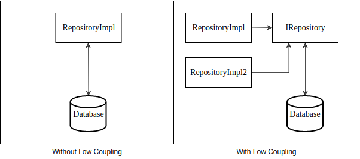

### Low Coupling
`It is necessary to distribute responsibilities between classes to ensure minimal coupling`

######Example with violation:
One of the examples of violation of this principle is cyclical dependence
```java
public class A {
    private int a;
    private B b;
   
    public A(int a) {
        this.a = a;
        this.b = new B(this);
    }
}

public class B {
    private A a;
    
    public B(A a) {
        this.a = a;
    }
}
```
Here we see the dependence of class `A` on class `B`, as well as the dependence of class `B` on class `A`.  
Why is that bad? The fact is that we cannot give class `A` without class `B`, as well as class `B` without class `A`: they cannot be reused separately, only together. 
The fewer connections between classes, the better, this is what the `Low Coupling` principle tells us.


If the objects in the application are tightly coupled, then any change in them leads to changes in all related objects. 
And this is inconvenient and creates many problems. 
`Low coupling` just says that it is necessary for the code to be loosely coupled and depend only on abstractions. 
`Low coupling` is also found in `SOLID` principles like `The Dependency Inversion Principle` and `Low Coupling` is essentially an implementation of the `Dependency Injection principle`. 
When we move away from concrete implementations and abstract at the interface levels (which are easy to replace with the implementations we need), then the code is not tied to specific implementations.


