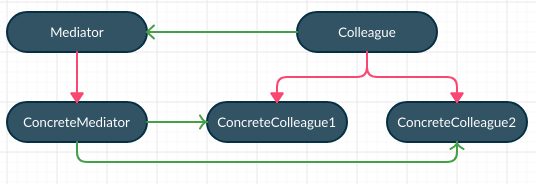
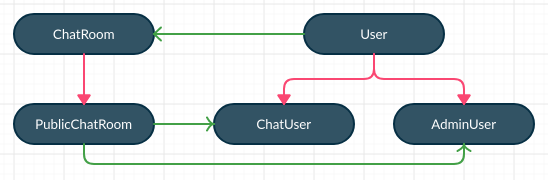

# Mediator
`Mediator helps in establishing loosely coupled communication between objects 
and helps in reducing the direct references to each other. 
This helps in minimizing the complexity of dependency management and communications among 
participating objects.`

Example:
   
Good example of mediator pattern is a chat application. 
In a chat application we can have several participants. 
It’s not a good idea to connect each participant to all the others because 
the number of connections would be really high. 
The best solution is to have a hub where all participants will connect; 
this hub is just the mediator class.

Design participants
- Mediator – defines the interface for communication between Colleague objects
- ConcreteMediator – implements the Mediator interface and coordinates communication between Colleague objects. It is aware of all of the Colleagues and their purposes with regards to inter-communication.
- Colleague – defines the interface for communication with other Colleagues through its Mediator
- ConcreteColleague – implements the Colleague interface and communicates with other Colleagues through its Mediator




So we are simulating the chat application where users can send messages to other users in one to one fashion. 
All users must be registered to the chat application to send or receive messages.  



Let's define User and ChatUser:

```java
public abstract class User {
    private final ChatRoom mediator;

    private final String id;
    private final String name;

    public User(ChatRoom room, String id, String name){
        this.mediator = room;
        this.name = name;
        this.id = id;
    }

    public abstract void send(String msg, String userId);
    public abstract void receive(String msg);

    public ChatRoom getMediator() {
        return mediator;
    }

    public String getId() {
        return id;
    }

    public String getName() {
        return name;
    }
}
```

ChatUser
```java
public class ChatUser extends User {
    public ChatUser(ChatRoom room, String id, String name) {
        super(room, id, name);
    }

    @Override
    public void send(String msg, String userId) {
        System.out.println(this.getName() + " :: Sending Message : " + msg);
        getMediator().sendMessage(msg, userId);
    }

    @Override
    public void receive(String msg) {
        System.out.println(this.getName() + " :: Received Message : " + msg);
    }

}
```

ChatRoom interface (mediator)
```java
public interface ChatRoom {
    void sendMessage(String msg, String userId);
    void addUser(User user);
}
```

PublicChatRoom
```java
public class PublicChatRoom implements ChatRoom {
    private Map<String, User> usersMap = new HashMap<>();

    @Override
    public void sendMessage(String msg, String userId) {
        User u = usersMap.get(userId);
        u.receive(msg);
    }

    @Override
    public void addUser(User user) {
        this.usersMap.put(user.getId(), user);
    }
}
```

Main
```java
public class Main {
    public static void main(String[] args) {
        ChatRoom chatroom = new PublicChatRoom();

        User user1 = new ChatUser(chatroom, "1", "Alex");
        User user2 = new ChatUser(chatroom, "2", "Brian");
        User user3 = new ChatUser(chatroom, "3", "Charles");
        User user4 = new ChatUser(chatroom, "4", "David");

        chatroom.addUser(user1);
        chatroom.addUser(user2);
        chatroom.addUser(user3);
        chatroom.addUser(user4);

        user1.send("Hello brian", "2");
        user2.send("Hey buddy", "1");
    }
}
```


#### Benefits of mediator pattern
- Using mediator pattern, we can reduce the complexity of communication between objects in a system. It promotes loose coupling and reduces number of subclasses in the system.

- Mediator helps in replacing “many-to-many” relationship with “one-to-many” relationships, so it is much easier to read and understand. Also the maintenance becomes easy due to centralized control of communication.

#### Drawbacks of mediator pattern
- The mediator object’s architecture may become complex if you put too much logic inside it. An inappropriate use of the mediator pattern may end up with a “God Class” anti-pattern.

#### Mediator pattern vs facade pattern
- Mediator pattern can be seen as a multiplexed facade pattern. In mediator, instead of working with an interface of a single object, you are making a multiplexed interface among multiple objects to provide smooth transitions.