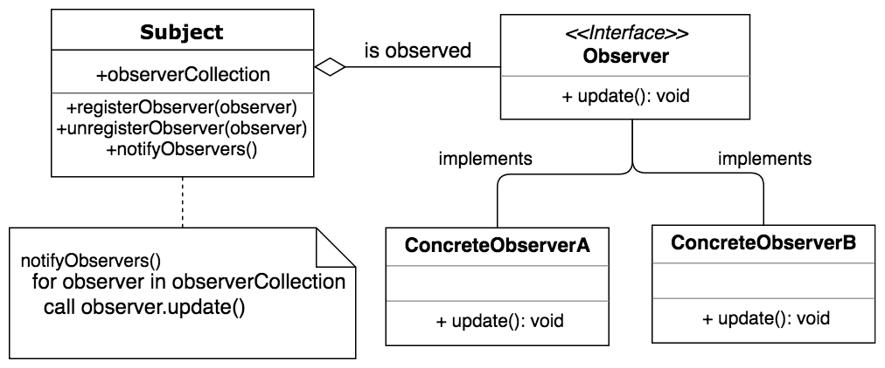

# Observer
`Lets you define a subscription mechanism to notify multiple objects about any events 
that happen to the object they’re observing`

When we try to implement the observer pattern, 
we generally create our Observer and Subject interfaces from scratch. 
However, Java also provides some classes: 
`java.util.Observer` interface for observers and `java.util.Observable` class for subjects. 
So, we can implement `Observer` pattern by yourself, or use java API for this purpose.

If we choose the second way, then we need to create classes that implement `java.util.Observer` interface. 
On the other hand, to create subjects, we need to extend `java.util.Observable` class.

Observer pattern’s class diagram:


As can be seen in the figure, all concrete observers must implement the Observer interface. 
The interface has one method that is called 
by the subject to notify the observers about a state change.

Each subject maintains a list of registered observers and calls the `notifyObservers` method 
to inform these observers about any updates or state changes. 
The subject also has methods for `registering` and `unregistering` observers.

Upd: these classes are deprecated since java 9. 
Instead we can use [PropertyChangeEvent and PropertyChangeListener from java.beans package](https://stackoverflow.com/a/46380252/10701730) 

Example: 

A news agency informs its subscribers when changes are occurred.

Firstly, we need to create a `Observable` class that keeps `PropertyChangeSupport` instance.
This helps send notifications to observers when a class property changes.
```java
public class NewsAgency {
    private String news;

    private final PropertyChangeSupport support;

    public NewsAgency() {
        support = new PropertyChangeSupport(this);
    }

    public void addPropertyChangeListener(PropertyChangeListener pcl) {
        support.addPropertyChangeListener(pcl);
    }

    public void removePropertyChangeListener(PropertyChangeListener pcl) {
        support.removePropertyChangeListener(pcl);
    }

    public void setNews(String value) {
        support.firePropertyChange("news", this.news, value);
        this.news = value;
    }
}
```

Using `this.support`, we can add and remove observers and notify them 
when the state of the observable class changes:
```java
support.firePropertyChange("news", this.news, value);
```

Here, the first argument is the name of the property being observed. 
The second and third arguments are its old and new values, respectively.


`Observers` must implement `PropertyChangeListener` interface
```java
public class NewsChannel implements PropertyChangeListener {
    private String news;

    @Override
    public void propertyChange(PropertyChangeEvent evt) {
        this.setNews((String) evt.getNewValue());
    }

    public String getNews() {
        return news;
    }

    public void setNews(String news) {
        this.news = news;
    }
}
```

Demo
```java
public class Demo {
    public static void main(String[] args) {
        NewsAgency observable = new NewsAgency();

        NewsChannel observer1 = new NewsChannel();
        NewsChannel observer2 = new NewsChannel();

        observable.addPropertyChangeListener(observer1);
        observable.addPropertyChangeListener(observer2);
        observable.setNews("news");

        System.out.println(observer1.getNews());
        System.out.println(observer2.getNews());
    }
}
```

Each time when we call `firePropertyChange` method inside `setNews` method, 
it will trigger `NewsChannel::propertyChange` method notifying each observer about changes.