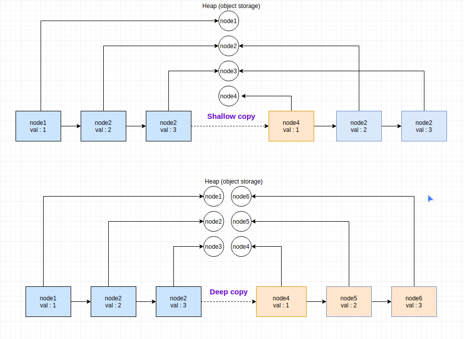

# Prototype
`The Prototype pattern is generally used when we have an instance of the class (prototype) 
and we'd like to create new objects by just copying the prototype.`

Example:
We have a class `Node` that contains reference on the next `Node` (simplified LinkedList).

```java
public class Node {
    public Node next;
    public int val;

    public Node(Node next, int val) {
        this.next = next;
        this.val = val;
    }
}
```


There exist two types of copying, shallow copy, and deep copy.  
- A `shallow copy` means the first level is copied, deeper levels are referenced
- A `deep copy` means the all levels is copied.

When using the prototype pattern you usually need to go for one of them. 
We will try to implement both to see the difference.


Adding two methods `shallowCopy` and `deepCopy` to the `Node` class:
 ```java
public class Node {
    public Node next;
    public int val;

    public Node(Node next, int val) {
        this.next = next;
        this.val = val;
    }

    /**
     * A shallow copy(c) means the first level is copied, deeper levels are referenced(r).
     *
     * input  = node1 -> node2 -> node3
     * return = node1(c) -> node2(r) -> node3(r)
     */
    public Node shallowCopy(Node node) {
        return new Node(node.next, node.val);
    }

    /**
     * A deep copy(c) means the all levels is copied.
     *
     * input  = node1 -> node2 -> node3
     * return = node1(c) -> node2(c) -> node3(c)
     */
    public Node deepCopy(Node node) {
        Node head = new Node(node.next, node.val);
        Node current = head;

        while (current.next != null) {
            Node next = current.next;
            current.next = new Node(next.next, next.val);
            current = current.next;
        }
        return head;
    }
}
```


Diagram for a better understanding of the difference between shallow and deep copy:
 

Let's write tests to be sure that our code is correct:
```java
public class NodeTest {

    /**
     * Only the first level of objects after shallow copy will point out on different objects in memory,
     * deeper levels will have the same references
     */
    @Test
    public void testShallowCopy() {
        Node node = testData();
        Node copy = node.shallowCopy(node);
        
        assertNotSame(node, copy);
        assertEquals(node.val, copy.val);

        assertSame(node.next, copy.next);
        assertEquals(node.next.val, copy.next.val);

        assertSame(node.next.next, copy.next.next);
        assertEquals(node.next.next.val, copy.next.next.val);

        // also change val for copy.next object since reference node.next == copy.next
        node.next.val = -1;
        assertEquals(node.next.val, copy.next.val);
    }

    /**
     * All level of objects after deep copy should point out on different objects in memory
     */
    @Test
    public void testDeepCopy() {
        Node node = testData();
        Node copy = node.deepCopy(node);

        assertNotSame(node, copy);
        assertEquals(node.val, copy.val);

        assertNotSame(node.next, copy.next);
        assertEquals(node.next.val, copy.next.val);

        assertNotSame(node.next.next, copy.next.next);
        assertEquals(node.next.next.val, copy.next.next.val);

        // only change val for node.next object since references node.next != copy.next
        node.next.val = -1;
        assertNotEquals(node.next.val, copy.next.val);
    }

    private Node testData() {
        return new Node(new Node(new Node(null, 3), 2), 1);   // 1 -> 2 -> 3
    }
}
```