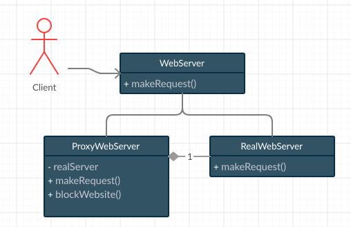

# Proxy
`Provides an object that acts as a substitute for a real service object used by a client. 
A proxy receives client requests, does some work (access control, caching, etc.) 
and then passes the request to a service object`

The proxy object has the same interface as a service, 
which makes it interchangeable with a real object when passed to a client.


Example:  


Let’s start by defining a `WebServer` interface:
```java
public interface WebServer {
    /** 
     * Method responsible for making a call to the webserver with a specific endpoint 
     **/
    void makeRequest(String url);
}
```

Let’s now implement the `RealWebServer` class 
which does the actual job of hitting a URL via network API calls
RealWebServer
```java
public class RealWebServer implements WebServer {
    @Override
    public void makeRequest(String url) {
        System.out.println("Making request to " + url);
    }
}
```

Finally, we’ll create a proxy server and expose it to our clients. 
We add additional logic to `makeRequest` method 
that may restrict access to an wrapping object (`RealWebServer` in example)
if a website is on the blacklist.
 
```java
public class ProxyWebServer implements WebServer {
    private final RealWebServer realServer;
    private final Set<String> blockedSites = new HashSet<>();

    public ProxyWebServer() { this.realServer = new RealWebServer(); }

    public void blockWebsite(String url) {
        System.out.println("Add website to black list: " + url);
        this.blockedSites.add(url);
    }

    @Override
    public void makeRequest(String url) {
        if(blockedSites.contains(url)) {
            System.out.println("This website is blocked. Remove website from black list or contact your administrator");
            return;
        }

        realServer.makeRequest(url);
    }
}
```

Client
```java
public class Client {
    private final WebServer server = new ProxyWebServer();

    public static void main(String[] args) {
        //code in main method
        Client client = new Client();
        client.makeRequest("www.facebook.com");
        client.addSiteToBlackList("www.facebook.com");
        client.makeRequest("www.facebook.com");
        // Prints 'This website is blocked. Contact your administrator'
    }

    void makeRequest(String url) {
        server.makeRequest(url);
    }

    void addSiteToBlackList(String url) {
        if (server instanceof ProxyWebServer proxy) {
            proxy.blockWebsite(url);
            return;
        }

        throw new UnsupportedOperationException("The current version of the web server does not support blocking sites");
    }
}
```


You may noticed that `Proxy` pattern is very similar to `Decorator` pattern, 
and it's true but, in fact, they have different purposes.
`Decorator` pattern focuses on dynamically adding additional behavior to an object, 
while `Proxy` pattern focuses on controlling access to an object.