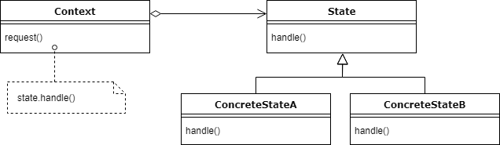

# State
`The main idea of State pattern is to allow the object for changing its behavior 
without changing its class`

Also, by implementing State pattern, 
the code should remain cleaner without many if/else statements.

Pros:
- Single Responsibility Principle. Organize the code related to particular states into separate classes.
- Open/Closed Principle. Introduce new states without changing existing state classes or the context.
- Simplify the code of the context by eliminating bulky state machine conditionals.

Cons:
- Applying the pattern can be overkill if a state machine has only a few states or rarely changes.

Architecture


 Design participants:  
`State` – The interface define operations which each state must handle.  
`Concrete States` – The classes which contain the state specific behavior.  
`Context` – Defines an interface to client to interact. It maintains references to concrete state object which may be used to define current state of object. 
It delegates state-specific behavior to different State objects.

Example:  

First, let's define our `Context`, that's going to be a `Package` class.
Each `Package` has state: ordered, delivered or received, initial one is ordered:
```java
public class Package {
    private PackageState state = new OrderedState();

    public void previousState() {
        state.prev(this);
    }

    public void nextState() {
        state.next(this);
    }

    public void printStatus() {
        state.printStatus();
    }

    public PackageState getState() {
        return state;
    }

    public void setState(PackageState state) {
        this.state = state;
    }
}
```

It contains a reference for managing the state, notice previousState(), nextState() 
and printStatus() methods where we delegate the job to the state object. 
The states will be linked to each other and every state will set another one 
based on this reference passed to both methods.

The client will interact with the `Package` class, 
yet he won't have to deal with setting the states, 
all the client has to do is go to the next or previous state.

PackageState
```java
public interface PackageState {
    void next(Package pkg);
    void prev(Package pkg);
    void printStatus();
}
```

OrderedState
```java
public class OrderedState implements PackageState {

    @Override
    public void next(Package pkg) {
        pkg.setState(new DeliveredState());
    }

    @Override
    public void prev(Package pkg) {
        System.out.println("The package is in its root state.");
    }

    @Override
    public void printStatus() {
        System.out.println("Package ordered, not delivered to the office yet.");
    }
}
```

DeliveredState
```java
public class DeliveredState implements PackageState {

    @Override
    public void next(Package pkg) {
        pkg.setState(new ReceivedState());
    }

    @Override
    public void prev(Package pkg) {
        pkg.setState(new OrderedState());
    }

    @Override
    public void printStatus() {
        System.out.println("Package delivered to post office, not received yet.");
    }
}
```

ReceivedState
```java
public class ReceivedState implements PackageState {

    @Override
    public void next(Package pkg) {
        System.out.println("This package is already received by a client.");
    }

    @Override
    public void prev(Package pkg) {
        pkg.setState(new DeliveredState());
    }

    @Override
    public void printStatus() {
        System.out.println("Package was received by client.");
    }
}
```


Demo
```java
public class Demo {
    public static void main(String[] args) {
        Package pkg = new Package();
        pkg.printStatus();

        pkg.nextState();
        pkg.printStatus();

        pkg.nextState();
        pkg.printStatus();

        pkg.nextState();
        pkg.printStatus();
    }
}
```

Output:
```
Package ordered, not delivered to the office yet.
Package delivered to post office, not received yet.
Package was received by client.
This package is already received by a client.
Package was received by client.
```

As we've been changing the state of our context, 
the behavior was changing but the class remains the same. 
As well as the API we make use of.

Also, the transition between the states has occurred, 
our class changed its state and consequentially its behavior.